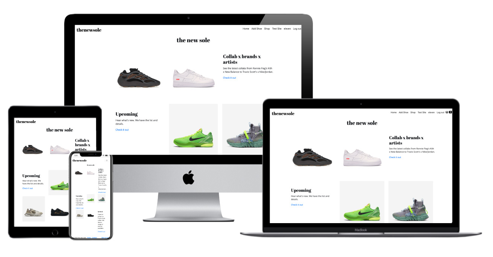

# thenewsole


An e-commerce website selling limited edition shoes. The working title for a shop name is called 'thenewsole' which sounds modern and contemporary.

This project is inspired by my husband's enthusiasm for buying and selling unique, timeless branded shoes.

Here's the deployed heroku app for [**Admin Testing**](https://fg-proj4-the-new-sole.herokuapp.com/)

Login details for **admin testing**
|User | Password |
|--|--|
|eleven | eleven123|


Here's the deployed heroku app for [**Consumer Testing**](https://fg-proj4-the-new-sole.herokuapp.com/home_consumer)

Login details for **consumer testing**
|User | Password|
|--|--|
|consumer-test  | twelve123 |


## UX
 

#### RESEARCH
I interviewed my husband to know more about the quality, price of limited edition shoes. I asked him what his process is like in buying 'potential' shoes. Here's a list of questions


**What are the qualities of a sellable shoes (By order of importance)**
1. By model and design (eg. Jordan 1) (#1 in search engine)
2. By collaboration between shoe brands and artists (eg. off-white(Virgil Abloh) with nike, kanye west with adidas) (#3 in search engine)
3. Limited edition (shoes are not common to sell / 'hard-to-find')
4. Check the stock take (if there is stock available, its not sellable. if it's sold out or hard to add in cart, there's potential for high-sell)
5. By common asian size > (#2 in search engine)
6. By reseller's budget 


**List of websites he checks every 3 times a week**
- https://www.copgarden.com/
- https://www.adidas.com.sg/yeezy
- https://www.nike.com/
- https://stockx.com/


**What is your process in buying the shoes when there's an upcoming new release**
1. Checks the website for availability of that specific model
2. Selects the shoe size
3. Adds to cart (if it fails to add to cart, repeat this process)
4. Submit payment 


**Where do you sell these shoes?**
1. Carousell
2. Facebook Marketplace


**For ideas in creating wireframe for the 'the new sole' website, I did a usability test using [stocksx.com](https://stockx.com/) as my main reference with my husband. These are the directions / questions I asked him.**

<dl>
  <dt>Imagine you are about to buy a potential shoes, which part of the page do you first check?</dt>
  <dd> > Answer: I go to the popular release and click on the brand name</dd>

  <dt>Now that we are in the popular page, what do you do next?</dt>
  <dd> > Answer: I browse the page for the model I'm looking for</dd>

  <dt>When you see the model image, what's your next step?</dt>
  <dd> > Answer: I check for availability. If it's not available, I browse the other models</dd>

  <dt>Is there a way that you can reserve that model?</dt>
  <dd> > Answer: No, because this website don't allow you to do it. </dd>

  <dt>When you see that another model is available, what do you do? </dt>
  <dd> > Answer: I add it to cart. But there's a case that it is difficult to add it in due to high-demand so I have to be patient.</dd>

  <dt>I noticed that this other model with the same brand is available and easy to add to cart. Why is that?</dt>
  <dd> > Answer: Oh because the size is a smaller size and not that common. So the value may not be as high as I want to sell.</dd>

  <dt>How often do you visit this page?</dt>
  <dd> > Answer: It depends. If there's no new release coming up, I will check it once a week but if there's is, its 3x a week. </dd>

  <dt>Where do you hear the news about these new release?</dt>
  <dd> > Answer: Through facebook page or youtube shoe enthusiast. </dd>

</dl>


**User Profiles**

Majority of the users demographics are based on:
- Male, between 20 years old to 40 years old. 
- majority of users are college to working men 
- active in social media 

The target users of this website will be:
- shoe enthusiast
- shoe reseller 
- admin
 

1. **Specific buyer who buys for personal use or shoe reseller**
    - someone who is looking for specific model of a shoe brand
    - a registered user of the website who will be lead to 'login' page to access his profile
    - likes to check on reviews in 'review' section of the page

2. **Browser**
    - someone who is casually browsing through the 'landing page'
    - likes to research more about the shoe brand and price by checking out the 'landing page', 'most popular' and 'new release' products
    - a non-member or guest of the website

3. **Admin**
    - a superuser who will login through the 'admin' page to access the backend page of the website
    - someone who uploads or updates the product information, images and prices
    - someone who has the information about the shoes new releases and shoe purchases


#### DESIGN

- I'm using **Abril Fatface** font by Google Fonts. I picked this for its contemporary style and bold type represents a strong emphasis on the webpage. This font is complemented by Open sans type which will be used for body text, prices, shoe models and reviews, 

- **Color** used will be black and white. I observed that most shoe websites have a plain background. This is to showcase the product details and design. 

- I'm taking a simple approach to this website to showcase more on the products.

- This will be mobile responsive which can be viewed in tablets and mobile phones as well. 


#### WIREFRAME

Here's the link to [desktop wireframe](https://www.figma.com/proto/UOeEbZ3kND6oXprh5DoQfc/theNewSole?node-id=4%3A677&viewport=-353%2C-728%2C0.31433194875717163&scaling=min-zoom)
and [mobile wireframe](https://www.figma.com/proto/UOeEbZ3kND6oXprh5DoQfc/theNewSole?node-id=14%3A3&viewport=132%2C985%2C0.1892523318529129&scaling=scale-down)


## Features and User stories

### Existing Features

The website will feature the following:

#### Admin Page 
- **Login Page** - this is the first page that shows up when admin clicked on deployed link
- **Sign up page** - For users who haven't created an account yet.
- **Homepage** - Welcome page with hero image and introduction of the website
- **Product Listing Page** - shows product listing page with Admin's sub menu navigation component
    - **Carousel** - 3 carousel images are shown to showcase popular and new released shoe models
    - **Search bar** - this allows shoe enthusiast or shoe reseller users to check on shoe model's availability or shoe sizes. It will lead to a display result page. Shoe sizes and tags are not in function yet and to be added in later development. 
    - **Product list** - this shows a list of shoes added by admin. User can categorise the shoe models by **In-stock**, **Upcoming**, & **Sold-out**
    
    
- **Admin Sub Menu**
    - **Add Shoe** - this allows user to add a product in a faster and easier access. 
    - **Visit Consumer page** - this allows user to view the page in a consumers' point of view. This shows the **Shop** page but without the Create, Edit and Delete buttons of the product.
    - **Go to Admin** - this allows user to check Django administration page
   

- **Product Display Page** - shows the shoe model's product description, shoe size, add to card
   - **Shoe Specification** - this allows shoe enthusiast or shoe reseller to view the product feature and size availability. Also to add the product to cart.
   - **You might also like** - when consumer scrolls down this page, this section is shown. The idea is to filter the products based on selected shoes. This will be done in later development. The idea now is to show this section in the page is available. 
   - **Ratings & Review** - this allows shoe enthusiast and reseller to have a more detailed research about the product and will help them create a decision in adding it to cart. (Function to be added in later development)
   - **Write your review** - This page is for shoe enthusiast / reseller to answer a short form about the product. A login is required to access this feature. (Function to be added in later development)
   - **There's a total of 6 inputs to fill up and answer.**
    1. **Star Ratings** - There's an overall rating of up to 5 stars available for shoe enthusiast and resellers to rate a product. (Function to be added in later development)
    2. **Opinion** - consumer can write a one sentence opinion about the product. (Layout to be improved and function to be added in later development)
    3. **Details** - consumer can write a detailed review about the shoes. (Layout to be improved and function to be added in later development)
    4. **Recommend** - This is answerable by yes or no by consumer. (Function to be added in later development)
   - **Add to cart** - this allows shoe enthusiast or shoe reseller to add products to a cart and checkout
- **Logout** - User can logout from the admin page

| User Stories   |      Features      |  Remarks |
|----------|:-------------:|------:|
| User can click on the admin-testing website |  Homepage (Admin) | Pass |
| User can sign up for an account | Sign up page  |  Pass  |
| User can login to an account |  Login page  | Pass |
| User can navigate to Shop |  Shop page | Pass |
| User can add a shoe model |  Front-end Admin page > Create Shoe page | Pass |
| User can edit the shoe model |  Front-end Admin page > Edit Shoe page | Pass |
| User can delete the shoe model |  Front-end Admin page > Delete Shoe page | Pass |
| User can user search  bar |  Search | Pass |
| User can navigate to Django Administration |  Django Admin page | Pass |
| User can navigate to product display page |  PDP | Pass |
| User can purchase the shoe model  |  Stripe Purchase page | Pass |
| User can navigate back to Checkout page |  Checkout success page  | Pass |
| User can check the purchased shoe in backend |  Django Admin page  | Pass |
| User can write a review  |  Ratings and Review page  | CRUD on write reviews - For later development. |
| User can logout from page |  Checkout success page  | Pass on backend. Front-end for later development |
| User can submit an order query  |  Contact page  | CRUD on contact page - For later development. |
| User can check on related items after clicking on shoe model from PLP | PDP > You might also like | Algorithm - For later development. |
| User can view this website in other devices |  Checkout success page  | Pass |
| User can navigate back to Checkout page |  Mobile responsiveness | Pass |


#### Consumer page
- **Main page** - this allows shoe enthusiast or shoe reseller to check the popular, and new release shoes. Prices and model names are shown together with the product images. 
- **Login Page** - login is required for consumers to be able to buy the 
- **Sign up page** - For users who haven't created an account yet.
- **Homepage** - Welcome page with hero image and introduction of the website
- **Product Listing Page (PLP)** - shows product listing page with Admin's sub menu navigation component
    - **Carousel** - 3 carousel images are shown to showcase popular and new released shoe models
    - **Search bar** - this allows shoe enthusiast or shoe reseller users to check on shoe model's availability or shoe sizes. It will lead to a display result page. Shoe sizes and tags are not in function yet and to be added in later development. 
    - **Product list** - this shows a list of shoes added by admin. User can categorise the shoe models by **In-stock**, **Upcoming**, & **Sold-out**
   
| User Stories   |      Features      |    Remarks   |
|----------|:-------------:|------:|
| User can click on the consumer-testing website before logging in | Homepage (Consumer) | Pass |
| User can view consumer homepage after logging in | Homepage (Consumer) | Navigation - For later development |
| User can view the product listing page | PLP | Pass |
| User can view the product display page | PDP | Pass. Image media query for later development |
| User can add shoe in cart | Shopping cart page | Pass |
| User can purchase the shoe model  | Stripe Purchase page | Pass |
| User can navigate back from Checkout page | Checkout success page  | Success on backend. Front-end - For later development |
| User can write a review | Ratings and Review page | CRUD on write reviews - For later development |
| User can logout from page | Logout page | Pass |
| User can submit an order query  | Contact page | CRUD on contact page - For later development |
| User can check on related items after clicking on shoe model from PLP | PDP > You might also like | Algorithm - For later development |
| User can view this website in other devices | Mobile responsiveness | Pass |


### Features Left to Implement
- **Write Review** - I will add in the review form in later development.
- **Order Tracker** - I'm planning to add an order tracker which will asks for the buyer's order number and email address. 
- **Newsletter signup** - To extend website visitors reach, I want to add this option to
- **SEO** - optimise the web content to reach top rank in search engine. Focus on writing meaningful image alt text and meta tags.
- **Chatbot** - To respond to order update enquiries.
- **Search engine** - to add search by sizes and tags. 
- **Search Submit button** - to be added in later development. 
- **UI/UX Design in General** - design in all pages such as Admin and Consumer pages, product information, cart, user authentication, and checkout pages to be improved in later development. 


## Database Design

**ER** diagram of this project's data base can be access [here](https://github.com/francesjgonzales/final-proj4/blob/master/static/shoe_erd_final.png)


## Technologies Used

In this section, these are the tools, languages, frameworks, and libraries I used for this project. 
- [HTML](https://www.w3schools.com/html/) 
    - This is used to create structure for web pages.
- [CSS](https://www.w3schools.com/css/) 
    - This is used to style the website by adding fonts, colors and design.
- [JQuery](https://jquery.com)
    - Used JQuery minified version for Cloudinary.
- [Bootstrap](https://getbootstrap.com/) 
    - This is used for web responsiveness and also used pre-built components.  
- [Figma](https://www.figma.com/) 
    - For designing wireframes 
- [Cloudinary](https://cloudinary.com/) 
    - For uploading images to cloud for storage.
- [Stripes](https://stripe.com/en-sg)
    - Online payment processing for e-commerce website
- [Illustrator](https://www.adobe.com/sea/products/illustrator.html)
    - For resizing images for consistent card sizes. 


## Testing

There are 2 types of testing done. Please refer to **Features and User Stories** for more details.

Here's the deployed heroku app for [**Admin Testing**](https://fg-proj4-the-new-sole.herokuapp.com/)

Login details for **admin testing**
|User | Password |
|--|--|
|eleven | eleven123|


Here's the deployed heroku app for [**Consumer Testing**](https://fg-proj4-the-new-sole.herokuapp.com/home_consumer)

Login details for **consumer testing**
|User | Password|
|--|--|
|consumer-test  | twelve123 |


## Deployment

I used Gitpod as my main source of working on this project using a master branch. 

1. Created my github repository then worked on Gitpod as my main workspace while using a master branch. 

2. Used Django for rapid development. 
```
pip3 install django
```

3. During the process, this code is used for sanity check - HttpResponse and to make sure that all are up and running I used 8080 port to view my browser.

4. When adding new models or installing a user authentication, these codes are used to create tables and columns inside Django's database. This also applies when a model is modified. 
```
python3 manage.py makemigrations
```
```
python3 manage.py migrate
```

5. Used Cloudinary to upload images. 
```
pip3 install cloudinary
```
```
pip3 install python-dotenv
```
    - For Python configuration settings, a dotenv file is installed and imported in Django environment. A dotenv is used to store the cloudinary's Cloud name, API key and API secret keys. 
    - Dotenv is added to .gitignore file. 
    - For Cloudinary configuration, added cloudinary's os.environ in settings.py file. Next, registered Cloudinary by adding it in INSTALLED APPS.

6. Set up a User Authentication
```
pip3 install django-allauth
```
    - Added the Authentication backends in settings.py.
    - Defined a SITE_ID which will Allauth will need to identify.
    - Authentication Method, Email required, email verification, sign up email, username, login URL and login REDIRECT URL are added in after SITE_ID. 

7. Flash Messages 
    - Enabled messages in Django to activate flash messages. This is found in settings.py and added the MESSAGE_STORAGE code. 

8. Crispy Forms
    - For better form format, this is downloaded using css classes from Bootstrap. 
```
pip3 install django-crispy-forms
```

9. Used Stripes as online payment 
    - A dotenv is used to store the publishable, secret and webhook keys. 
    - A CSRF decorator is imported to provide protection against Cross
    
10. Deploying in Heroku
    - The following dependencies are installed 
```
pip3 install gunicorn 
pip3 install psycopg2 (this is used to install postgres)
pip3 install Pillow (this is installed for image processing)
pip3 install whitenoise 
pip3 install dj_database_url
```
    - Login to heroku 
    ```
    heroku login -i
    ```
    - Migrate all dotenv secret keys in Heroku website
    - Procfile is created 
    - In settings.py, under ALLOWED_HOST, the heroku link is added. 
    - To let Heroku know what packages are installed, a requirements.txt is generated. 
    ```
    pip3 freeze --local > requirements.txt
    ```
    - Set up Database from sqlite to postgres. Commented out the existing sql and migrated database to postgres.
    - Updated Webhook's API secret key to ensure Stripes work in heroku environment.

11. Set up email via GMAIL to ensure Allauth email validation works. Added HOST_PASS and USER and TEST_EMAIL into dotenv. 


## Credits

### Content
- The code used for cloudinary was copied from Paul's Django notes 
- Used [Django MultiSelectField](https://pypi.org/project/django-multiselectfield/) as alternative option. To be used in later development
- Cart icon svg code copied from [bootstrap](https://icons.getbootstrap.com/icons/basket2/)
- The code for price cart was copied from [Yi Sheng Lee's project](https://github.com/YiShengLee/Golden-Bee-Shop/blob/master/Cart/templates/view_cart.template.html)
- Cloudinary, Stripes and checkout code are copied from Paul Chor's [repository](https://github.com/kunxin-chor/tgc8-django-bookreviews/tree/checkpoint-ecommerce-done/checkout) 
- Scroll to top button was copied from [w3schools.com](https://www.w3schools.com/howto/howto_js_scroll_to_top.asp)

### Media
- The product photos used in this site were obtained from nike, adidas and copgarden websites for the purpose of this project only.

### Acknowledgements

- I received inspiration for this project from my husband and to my supportive classmates of Batch 8! 
